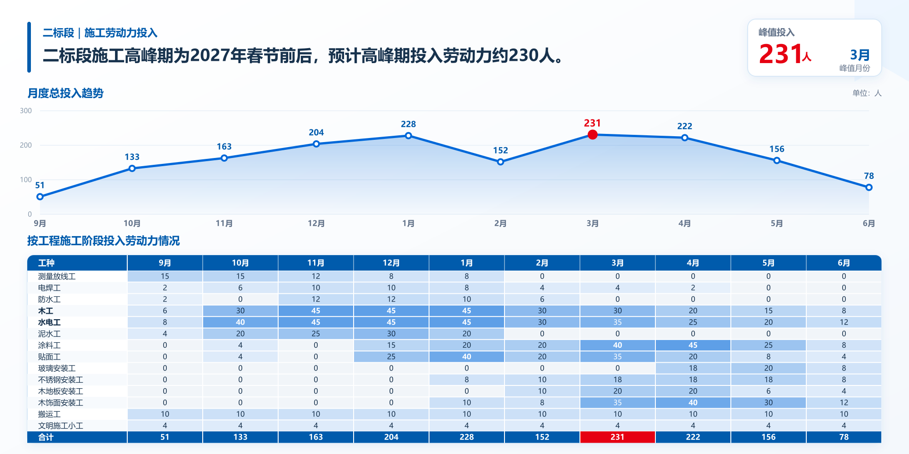
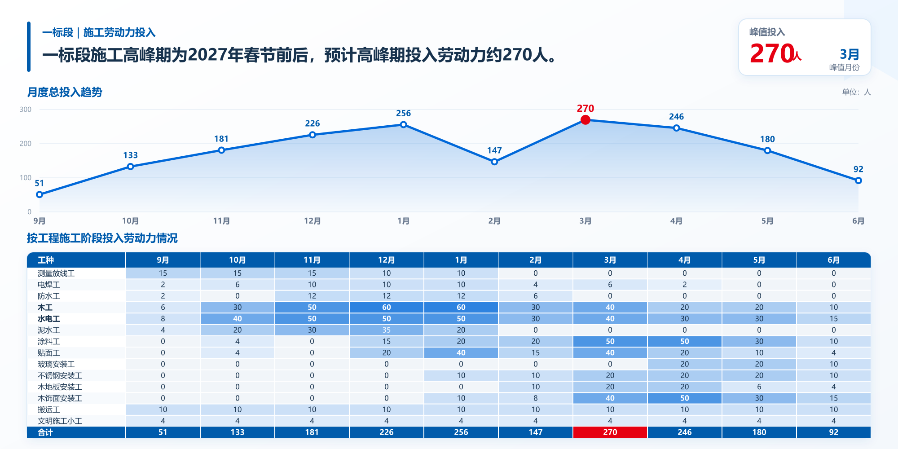

# Unify Construction PPT Visuals

面向工程技术标、述标汇报、专项施工方案、施工部署与 BIM 应用 PPT 的视觉统一 Skill。

它会先理解页面目的、实体、关系和阅读顺序，再重新组织版式；不要求照抄原页面，但必须完整保留主要内容、数字和工程事实。默认输出严格 `2:1`、不含企业表头、Logo、页码和页脚的纯内容区图片，以中建蓝为主色，并对跨页模板、组件坐标和辅助色语义进行锁定。

## 一句话安装

把下面这句话发送给支持 `$skill-installer` 的 Codex：

> 请使用 `$skill-installer`，从 GitHub 仓库 `zch2896615310-sys/unify-construction-ppt-visuals` 的路径 `skills/unify-construction-ppt-visuals` 安装 Skill。

安装完成后，新 Skill 通常会在下一轮对话中可用；如果没有出现，请重启 Codex。

## 一句话更新

> 请把已安装的 `unify-construction-ppt-visuals` 备份后替换为 `zch2896615310-sys/unify-construction-ppt-visuals` 仓库 `main` 分支中 `skills/unify-construction-ppt-visuals` 路径的最新版本，并验证 `SKILL.md`。

安装器默认不会覆盖同名目录，因此更新时需要先备份或移除旧版本，再重新安装。

## 典型用法

- “按中建蓝述标风格美化这几页 PPT，保持跨页一致。”
- “只生成表头以下的内容区，比例 2:1。”
- “不拘泥原排版，先理解内容，再重新排版，主要内容和数据不变。”
- “这两页内容结构相似，请使用同一个固定模板。”

也可以显式调用：

> 使用 `$unify-construction-ppt-visuals` 美化这些工程 PPT 页面。

## 设计原则

1. 先建立内容账本和语义模型，再开始排版。
2. 首次设计同类页面时允许重构旧版式；模板冻结后，同类页面只替换数据。
3. 中建蓝、白色和浅蓝灰占绝对主导，辅助色具有固定语义。
4. 中文文字、数字、专业逻辑和源图事实优先于装饰效果。
5. 默认使用确定性分层合成，避免依赖随机整页生成。

## 示例

二标段劳动力投入计划：



一标段劳动力投入计划：



## 仓库结构

```text
skills/unify-construction-ppt-visuals/
├── SKILL.md
├── agents/openai.yaml
├── references/
│   ├── prompt-contract.md
│   ├── style-bible.md
│   └── template-registry.md
└── scripts/build_prompts.py
```

## License

[MIT License](LICENSE)
